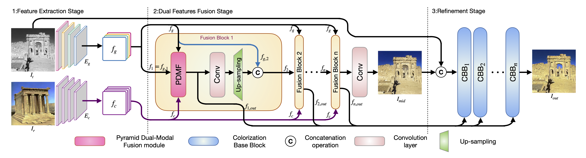
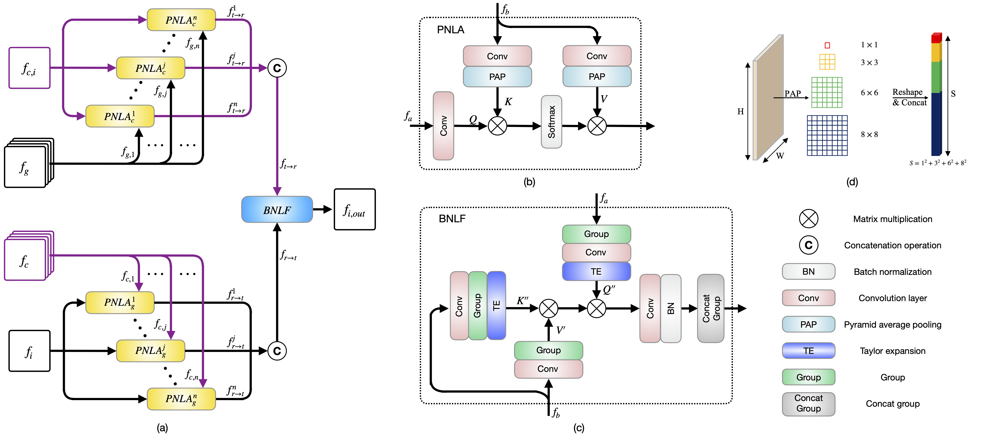

# PDNLA-Net-Pytorch

**Unsupervised Deep Exemplar Colorization via Pyramid Dual Non-local Attention** <br>
*Hanzhang Wang, Deming Zhai, Xianming Liu, Junjun Jiang, Wen Gao* <br>
IEEE Transactions on Image Processing (TIP), 2023 <br>
[[Paper](https://ieeexplore.ieee.org/abstract/document/10183846)]

## Reference

Citation:

```latex
@article{wang2023pdnlanet,
  title={Unsupervised Deep Exemplar Colorization via Pyramid Dual Non-local Attention},
  author={Wang, Hanzhang and Zhai, Deming and Liu, Xianming and Jiang, Junjun and Gao, Wen},
  journal={IEEE Transactions on Image Processing (TIP)},
  year={2023},
  publisher={IEEE}
}
```

## Requirements

- python==3.6.13
- pytorch==1.7.1
- torchvision==0.8.2
- pillow==8.3.1

```
conda create -n pdnla python=3.6
conda activate pdnla
conda install pytorch==1.7.1 torchvision==0.8.2  cudatoolkit=11.0 -c pytorch
pip install -r requirements.txt
```

## Pretrained Model and Results

We uploaded the [pre-trained model](https://drive.google.com/drive/folders/1O2Sjiecos4qN0wRi6fqmyc4XWQNoaulr?usp=sharing) to Google Cloud.

We provide the results of some [test images](https://drive.google.com/drive/folders/1qkb668XB4EY7Hc0n3Sb5KBjYVELiON8u?usp=sharing), some from selected grayscale images and corresponding reference color images, and some randomly selected from imagenet. If you want to compare with our method, you can train by yourself, or directly use the pre-trained model to test, or directly select the results from some of the results we provide for comparison.

## Test

```python
python generate_image.py --files1 ./test_image/contents --files2 ./test_image/color --ckpt_dir <ckpt_file_name> --result_dir ./result/
```

## Introduction

Exemplar-based colorization is a challenging task, which attempts to add colors to the target grayscale image with the aid of a reference color image, so as to keep the target semantic content while with the reference color style.
In order to achieve visually plausible chromatic results, it is important to sufficiently exploit the global color style and the semantic color information of the  reference color image.
However, existing methods are either clumsy in exploiting the semantic color information, or lack of the dedicated fusion mechanism to decorate the target grayscale image with the reference semantic color information.
Besides, these methods usually use a single-stage encoder-decoder architecture, which results in the loss of spatial details.
To remedy these problems, we propose an effective exemplar colorization strategy based on pyramid dual non-local attention network to exploit the long-range dependency as well as multi-scale correlation. Specifically, two symmetrical branches of pyramid non-local attention block are tailored to achieve  alignments from the target feature to the reference
feature and from the reference feature to the target feature respectively. The bidirectional non-local fusion strategy is further applied to get a sufficient fusion feature that achieves full semantic consistency between multi-modal information. To train the network, we propose an unsupervised learning manner, which employs the hybrid supervision including the pseudo paired supervision from the reference color images and unpaired supervision from both the target grayscale and reference color images.
Extensive experimental results are provided to demonstrate that our method achieves better photo-realistic colorization performance than the state-of-the-art methods.

## Our Architecture

The overall pipeline of our pyramid dual non-local attention (PDNLA) network:



In the following figure, we show that (a) the pyramid dual-modal fusion (PDMF) block; (b) the pyramid non-local attention (PNLA) component; (c) the bidirectional non-local fusion (BNLF) component; (d) the pyramid average pooling (PAP):




